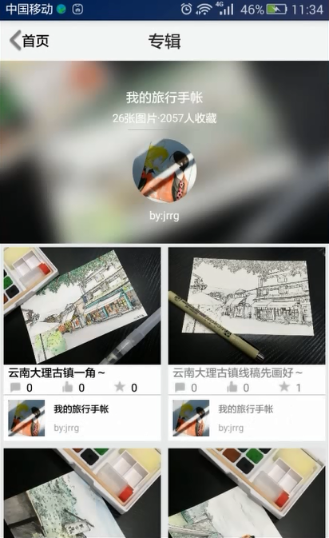
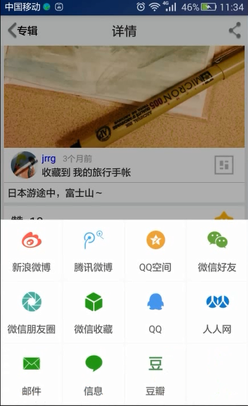
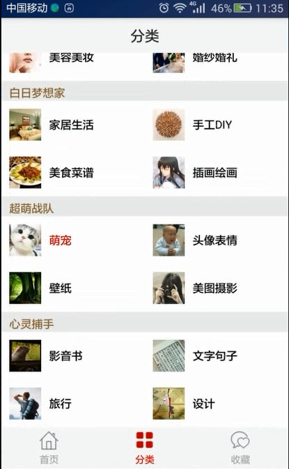

# 仿堆糖画报，一款瀑布流布局的App

   

### 与[DuiTang-iOS](https://github.com/WizenZhang/DuiTang-iOS)使用相同数据接口，一款Android版本的瀑布流风格应用。

通过本项目，你可以了解到以下技术：

* Eclipse
* MVC
* Waterfall
* ViewPagerIndicator 
* JSON
* BitmapUtils
* HttpUtils
* NetworkUtils
* FastBlurUtil
* CacheUtils
* SharePreference
* DatabaseUtil
* RoundImageView
## 预览
[应用下载体验](https://raw.githubusercontent.com/WizenZhang/DuiTang-Android/master/堆糖画报/堆糖/bin/堆糖.apk)

                     


## 项目相关

### 项目环境

          

### 项目结构

```
com.example.duitang 
    - base                          基类
      - impl                        Tab基类
      - menu                        首页详情页基类
    - db                            数据库类
    - fragment                      fragment基类
    - global                        网络接口                
    - model                         模型接口
    - utils                         工具类                
    - view                          视图类     
ViewPagerIndicator                  轮播器框架库
waterfall                           瀑布流框架库
XUtilsLibrary                       工具库
```

## 建议及问题反馈

+ E-mail: [wizen_zhang@163.com](wizen_zhang@163.com)
+ GitHub: [https://github.com/WizenZhang/DuiTang-Android/issues](https://github.com/WizenZhang/DuiTang-Android/issues)

## 致谢

感谢[APKBUS](http://www.apkbus.com/forum.php)提供的安卓源码，为本项目的形成提供了很大的帮助。

***

By [Wizen Zhang](https://wizenzhang.github.io/).
